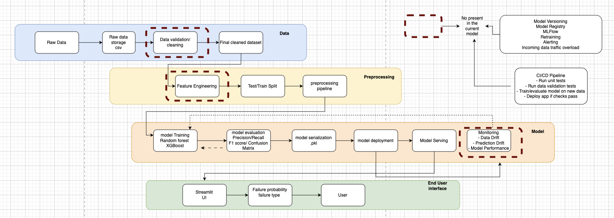

# Predictive maintenance system

## Live application
URL : https://predictivemaintenance-machines.streamlit.app/

Github Repo: https://github.com/Yashashwini1/predictive_maintenance.git


-----------------
Table of contents
-----------------

1. Problem Statement and system design
2. ML Pipeline and Model Evaluation results
3. Production readniness Critique
4. Web App deployment
----------------------------------------------------------------------------------

# 1. Problem Statement and system design


## Problem Statement: 
Unexpected machine failures can lead to production downtime, increased maintenance costs and operational disruptions. The objective of this project is to develop a predictive maintenance system capable of identifying machines at risk of failure before breakdown occurs. The system provides maintenance engineers with failure probability estimates and predicted failure types through a web application, enabling proactive maintenance planning and improved operational efficiency.
#### Dataset: The dataset is a synthetic predictive maintenance dataset that has failures that are encountered in the industry. It contains unique ID, productID,
features: air temerature, process temperature, roational speed, torque and tool wear taht represtenats the functioning of the machine. Target: Failure and type of failures occured in the machine.
#### Goal: A simple application for the maintenance engineers that detects an early failure warning of machines
#### UI: The predictions will be made availabe to the end user through a streamlit web app where the end user can observe overall fleet perfomances and failures occured along with individual machine failure probability , the risk levels : Low/medium/High and recommended actions.

#### Success: Measured by the systems ability to detect and warn potential failures before they occur in order to optimize the maintenance avtivites while preventing failures.

#### Cost: In operational context,
    `false negatives` is higher which is : model prediction fails- machine failure, downtime, sudden maintenance intervention, disruption of the supply chain, equipement damage, overload on the backup machines, delays, sudden repair costs, backlog 
    `False positives`: Overload on maintenance activites , unnessary maintenances cost 
#### Known Limitations

- The dataset contains 27 contradictory labels between `Target` and `Failure Type`.
- Random Failures were excluded from the failure-type model due to limited samples and label inconsistency.
- The binary model prioritizes recall over precision and may generate false alarms.

## System Design


Figure 1: The system consists of four layers:

### Data Layer
Responsible for data ingestion, validation, cleaning and preparation of machine sensor data before it enters the machine learning pipeline.

### Preprocessing Layer
Performs feature engineering, train-test splitting and preprocessing transformations. The preprocessing pipeline is fitted only on training data and reused during inference to ensure consistency between training and production.

### Model Layer
Responsible for model training, evaluation, serialization, deployment and serving. The model is evaluated using precision, recall, F1-score and confusion matrix before being serialized for deployment. Production enhancements such as monitoring, retraining, model registry and CI/CD are shown as future additions.

### End User Layer
Provides maintenance engineers with access to predictions through a Streamlit web application. Users can view failure probability, predicted failure type and risk level to support maintenance prioritization.

# Model Setection Stratergy:
It is a classifctaion problem and there are class imablances but the primary objective is to balance performance, robustness and explainability. Among the algorithms that can be conisdered For this data, RandomForest as model 1 and XGBoost for model 2 are considered. RandomForest predicts if a machine fails or not and XGBoost tells us what type of failure the machines is about to have. A Random Forest classifier was selected because it provides a strong balance between performance and interpretability. The model handles non-linear relationships effectively while still allowing feature
importance analysis to explain predictions. This is particularly important in predictive maintenance applications where maintenance engineers
need to trust and understand model outputs and is resiliant to outliers and XGBoost has High predictive performance and also it fit well for imbalanced dataset
Note: The target class of random failures was eliminated because of less size.  

-----------------------------------------------------------------------------------

# 2. ML Pipeline
-----------------------------------------------------------------------------------
The ml pipeline was designed to be modular, reproducible and production-oriented.
pipeline steps: Data Loader --> Data preprocessing --> Train/test Split --> preprocessing --> model training --> model evaluation --> model serialization
Preprocessing is fitted exclusively on the training set and then applied to the test set to prevent data
leakage. To prevent data leakage, the dataset was first split into training and test sets. All preprocessing steps, including categorical encoding, were fitted exclusively on the training data. The fitted preprocessing pipeline was then applied to the test data using the same learned transformations. This ensures that no information from the test set influences model training or feature engineering. The trained model and preprocessing pipeline are serialized and stored for inference within the
Streamlit application.

 # Model Evaluation Results
 The dataset exhibits class imbalance because machine failures occur much less frequently than normal
operation. For this reason, accuracy alone is not an appropriate evaluation metric
Evaluation Metrics: Recall, Precision, F1 Score, Confusion Matrix
Why Recall?
-->Recall was selected as the primary metric because the business objective is to detect as many true
failures as possible. A missed failure (false negative) can result in: Unplanned downtime, Lost production, Expensive repairs
Therefore, maximizing recall provides greater operational value than simply maximizing accuracy.
RandomForest: 
Failure Class (1)              

Precision = 0.63
Recall = 0.65
F1 = 0.64
Support = 68

Failure Class (0)              

Precision = 0.99
Recall = 0.99
F1 = 0.99
Support = 1932

The model struggles because of 1932 No Failure 68 Failure

XGBoost: The model is trained on only failures dataset i.e target is 1 and also removing random failures class is too small (Random Failures-18)
- Accuracy: 94%
- Heat Dissipation Failure: Precision 1.00 | Recall 1.00 | F1 1.00
- Overstrain Failure: Precision 0.92 | Recall 0.80 | F1 0.86
- Power Failure: Precision 0.87 | Recall 1.00 | F1 0.93
- Tool Wear Failure: Precision 0.90 | Recall 0.90 | F1 0.90

### Future Improvements

- Evaluate XGBoost for binary failure detection.
- Add SHAP explainability for individual predictions.
- Introduce automated drift monitoring.
- Implement CI/CD for automated deployment.
- Collect additional examples of Random Failures.
- Integrate maintenance history and machine operating conditions.

-----------------------------------------------------------------------------------
# 3.Production readniness Critique
----------------------------------------------------------------------------------
Monitoring Strategy:
Data Drift: monitoring the incoming data and changes in features Air Temperature, Process Temperature, Rotational Speed,Torque, Tool Wear. checking for aditional features and that were added. 
Model / prediction Drift: Model perfomance on failure prediction, for example : how many machines were predicted as failures a month ago and how many are we predicting currently. Retraining Based on the new ground truth information that was gathered from the engineers.
Bussiness performaces: How many actual failures vs predictions. How many failures missed by the model. Unexpacted Maintenance activities and regular planned maintenance activities. Keeping the engineers and their knowledge in the loop

# Retraining stratergy:
A scheduled retraining monthly or quaterly based on the data collection. Retraining if any drifts in data or model is observed and more importantly retraining if there has been any maintenance activity on the machines. Changes to the data from the machines after maintenances or repairs.
Retraining or re-running the pipeline if there are new machines on board and adjusting the metrics based on the new machines. Keeping the engineers and their knowledge in the loop. 

Before replacing the production model:
Train candidate model
Evaluate on the  current validation dataset
Compare against current production model: Precision and recall 
Deploy only if performance improves
Maintain rollback capability

Present model: The model would be retrained periodically (e.g., monthly or quarterly) or when sufficient new machine data becomes available. In a production environment, incoming sensor data and maintenance outcomes would be stored in a centralized data repository. A scheduled retraining pipeline would extract the latest labeled data, perform the same preprocessing steps, retrain both the binary failure detection model and the failure-type classification model, and log all experiments, metrics, and model artifacts using MLflow.

In addition to scheduled retraining, retraining could also be triggered by data drift or performance degradation. For example, if the distribution of torque, temperature, or rotational speed changes significantly from the training data, or if the observed failure detection rate drops below a predefined threshold, a retraining workflow would be initiated.

# Risks and how to mitigate them:
Data quality risk: Production data may differ from the training data due to sensor errors, missing values, or values outside the expected range. This can be mitigated by adding schema validation, range checks, missing-value handling, and alerts when incoming data does not match expected distributions.
Data Ingestion risk: If the ingestion pipeline is overloaded or delayed, predictions may not be available in time. This can be mitigated with queue-based ingestion, retry logic, logging, and monitoring of pipeline latency and failures.
Class imbalance risk: Failure events are rare, and the distribution of failure types may change over time. For example, random failures may become more frequent in production. This can be mitigated by monitoring class distributions, retraining with updated data, using class weighting or resampling techniques, and reviewing rare failure categories separately.
Model performance risk: The model may miss failures or generate too many false alarms. Since false negatives are more costly, recall and false negative rate should be monitored continuously. New models should only replace the live model after validation against the current production model.
Data drift risk: Machine behavior may change due to new operating conditions, new equipment, or seasonal effects. This can be mitigated by monitoring feature drift for variables such as torque, rotational speed, temperature, and tool wear, and triggering retraining when drift exceeds a defined threshold.

Prediction failure risk: The model service may fail or return invalid predictions. This can be mitigated with error handling, fallback rules, health checks, logging, and rollback to a previous stable model version.

UI risk: Maintenance engineers may misinterpret the prediction or overtrust the model. The app should clearly show failure probability, risk level, confidence, and recommended action, along with known limitations. The system should be positioned as decision support, not a replacement for engineering


## Project structure

```text
predictive_maintenance_pipeline/
├── app.py
├── requirements.txt
├── data/
│   └── predictive_maintenance.csv
├── models/
├── artifacts/
└── src/
    ├── config.py
    ├── data_loader.py
    ├── preprocessing.py
    ├── train_binary_model.py
    ├── train_failure_type_model.py
    ├── train_pipeline.py
    ├── predict.py
    └── utils.py
```

## Important scripts

- `src/data_loader.py` loads the CSV, removes ID columns, and validates required columns.
- `src/preprocessing.py` creates the feature list, train/test split, and preprocessing transformer.
- `src/train_binary_model.py` trains the Random Forest binary failure model.
- `src/train_failure_type_model.py` trains the XGBoost failure type model.
- `src/train_pipeline.py` runs the full training pipeline and saves the models.
- `src/predict.py` contains reusable hierarchical prediction logic.
- `app.py` is the Streamlit web app.

## How to run locally

Github Repo: https://github.com/Yashashwini1/predictive_maintenance.git

Install dependencies:

```bash
pip install -r requirements.txt
```

Add your dataset here:

```text
data/predictive_maintenance.csv
```

Train the models:

```bash
python src/train_pipeline.py
```

Run the app:

```bash
streamlit run app.py
```


